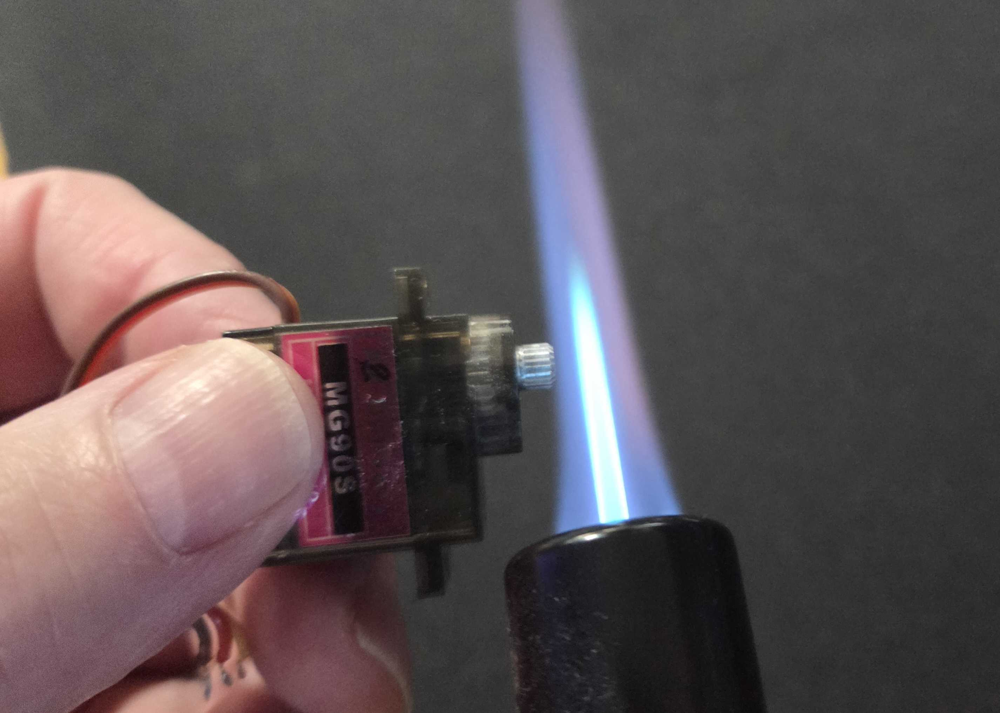
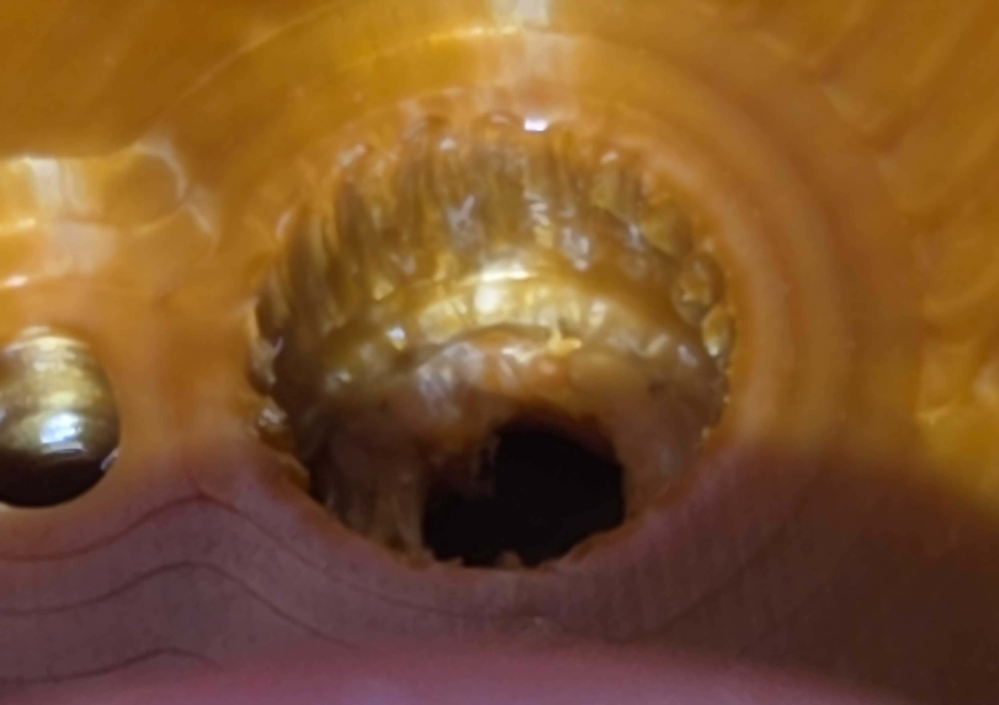

These STL files can be used to print pulleys with a tighter shaft hole, requiring to heat the servo motor shaft briefly but intensely before inserting it into the pulley.

This is **supposed to** ensure a tighter grip so that the pulley won't get lose on the motor shaft after a while, or if like me you experiment lifting heavy weights: 2kg was okay to hold, 4kg wore 3 pulleys out of 5, which became loose and would no longer action the fingers when the motors were running. I replaced them with this kind, but didn't try again.

It's experimental, can be risky for the motor, your finger, and your whole house in the worst case scenario.

1 - Heat the shaft without damaging the motor case:

2 - Then press it into the pulley firmly, and wait for one minute (depending on how hot it was)
You can then remove the pulley, the hole shaft will have little waves that fit nicely on the motor shaft.

OBVIOUSLY this is only to be done if your servo motors have a METALLIC shaft.