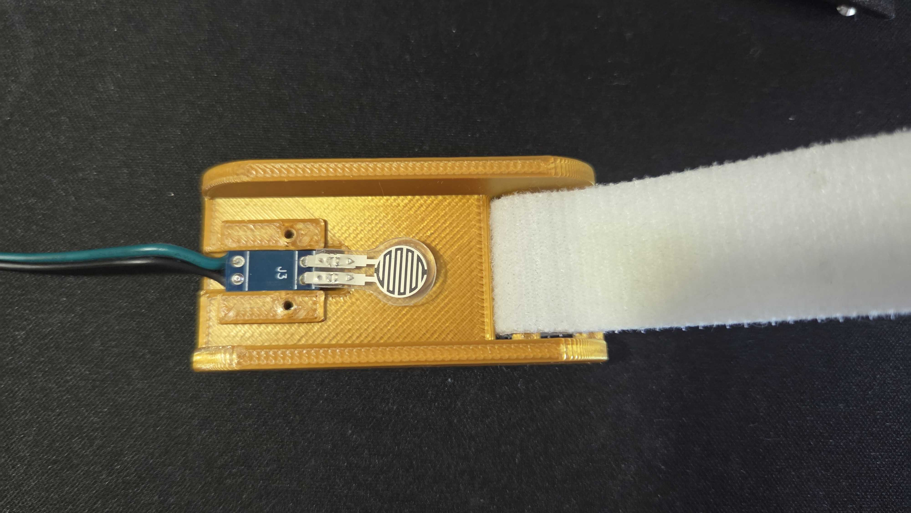
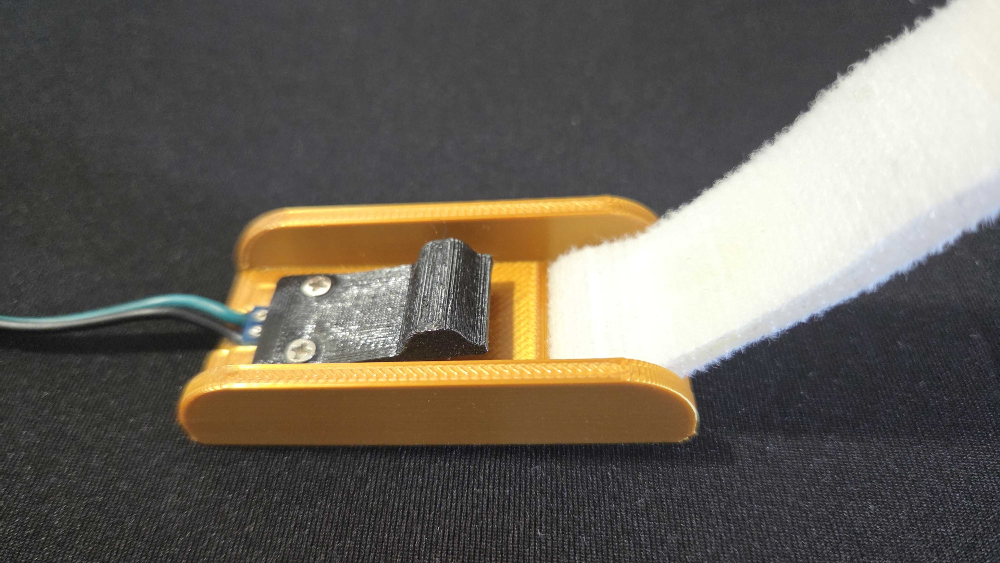
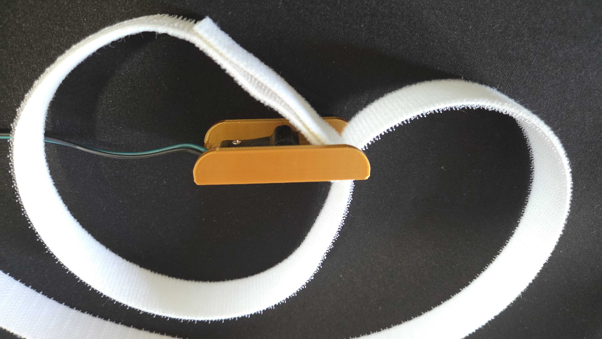
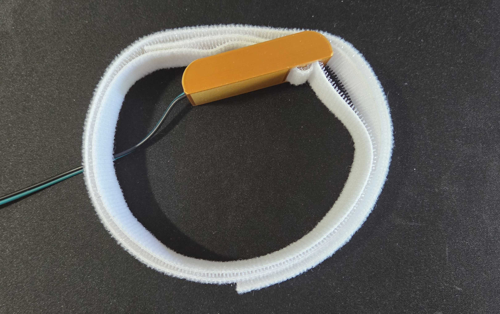

# Pressure sensor case

The base is printed in PLA, the press in TPU.

A small piece of pcb is used to hold the sensor in place, and it's then cover with a TPU piece ensuring a soft press on the sensor.

 

The arm band must first cover the sensor (to the left on the picture), then go around the arm, then up trough the case slot, then back around the arm and scratch to the part above the case.

 