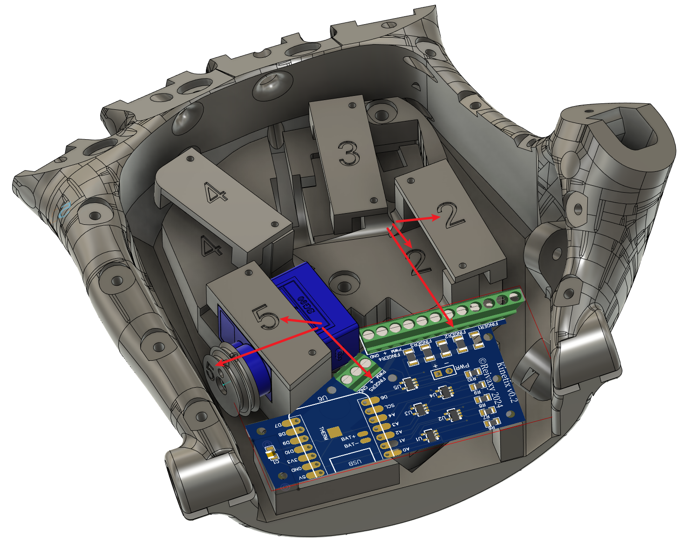

# KINETIX HAND

The 3D part of this work is based on the Kinetic Hand, created and released by Mat Bowtell:
https://www.thingiverse.com/thing:4618922 

The work in this repository is released under licence Creative Commons Attribution-NonCommercial-ShareAlike 4.0 International (CC BY-NC-SA 4.0) open-source license

Please read this license to understand what you may and may not do with these files (software and hardware):

https://creativecommons.org/licenses/by-nc-sa/4.0/

To me, the most important part of it is "non commercial": do not use this work to sell anything, in any way, no matter how derivative it is.

This is very much a Work in Progress:
- the current monitoring hasn't been tested yet
- the blue tooth connectivity and phone app are not started yet
- the software for esp32 is not available yet (soon)
               
Here is the early prototype testing speed:

https://github.com/reivaxy/kinetix/assets/3592991/b644f965-3c86-4bcd-a1fd-c3cf471b4016
                                                                                                            
Contrary to the original Kinetic hand, the Kinetix is not using TPU printed knuckles, because they put some strain on the servo motors which, being small, have then no strength left to hold anything.

Instead I've replaced them with print in place hinges which require no effort to bend, but which won't unfold the finger like the TPU ones were doing. This is achieved by pulling a wire on top of each finger when the motor turns in reverse.

The motors use double pulleys with different diameters, because the wires to fold the fingers and the ones to unfold the fingers do not have the same course. This also varies which is why each finger has its own double pulley, they should not be mixed up, so they have the finger number printed on them.

Thumb is 1, index is 2, and so on. 

These markings are also present on the hand and platform to place the right servos with their pulleys, on the servo covers, and on the PCB terminals to correctly plug the servo to the right terminal.

