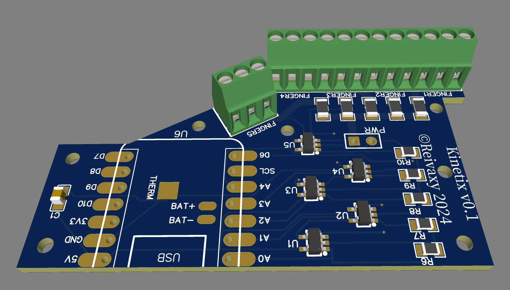

#PCB

This PCB was created using the online schema and pcb editors from https://easyeda.com/editor

The gerber zip file can be used to order PCBs. I ordered mine from https://jlcpcb.com, where I could get 5 pieces for under $5 shipping included.

They also have an option to mount the SMDs (except the ESP32) for you.

